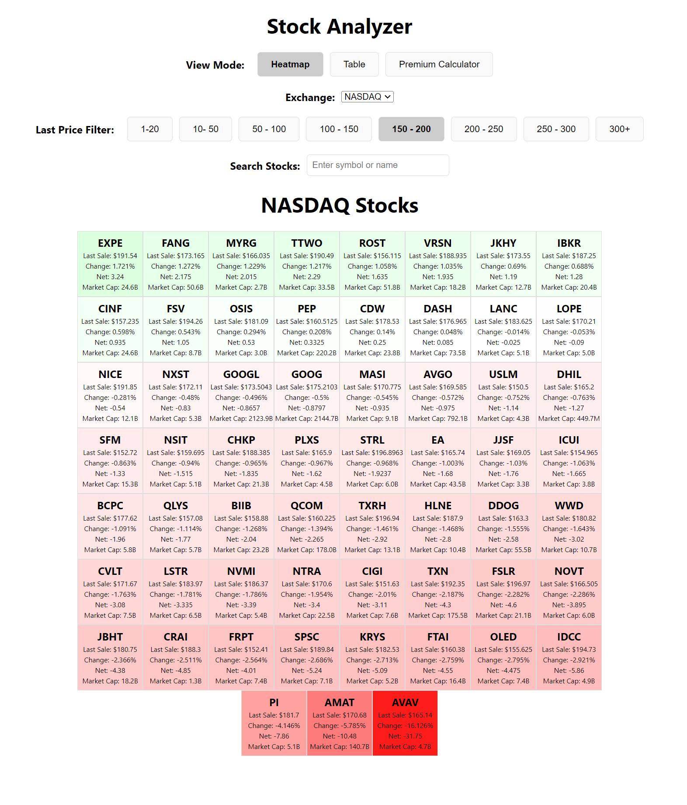
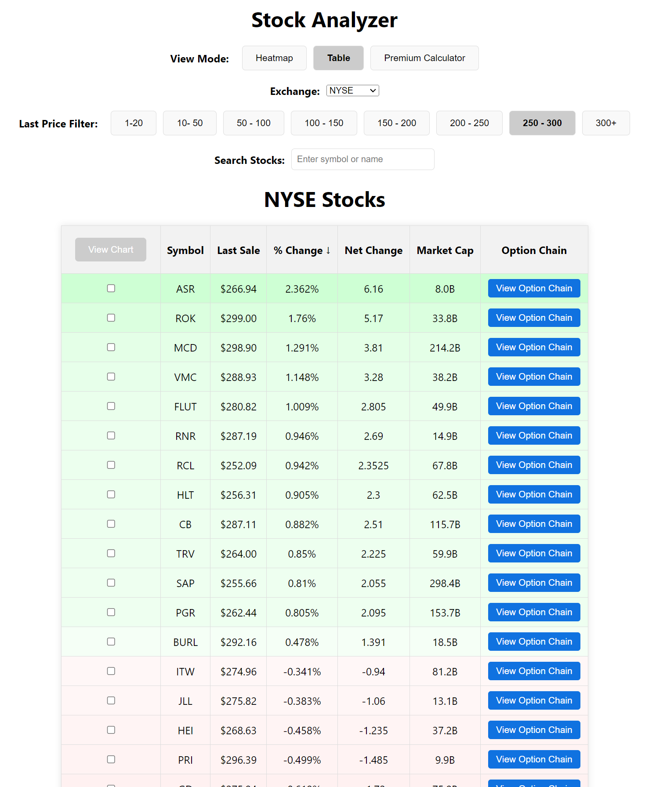
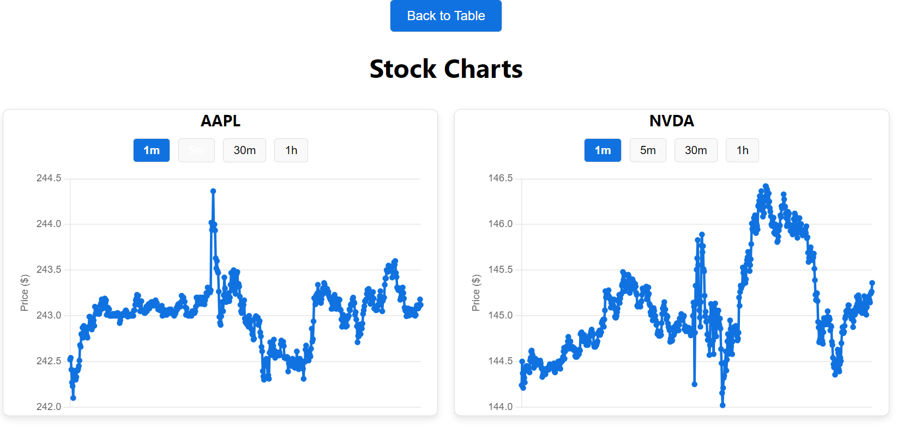
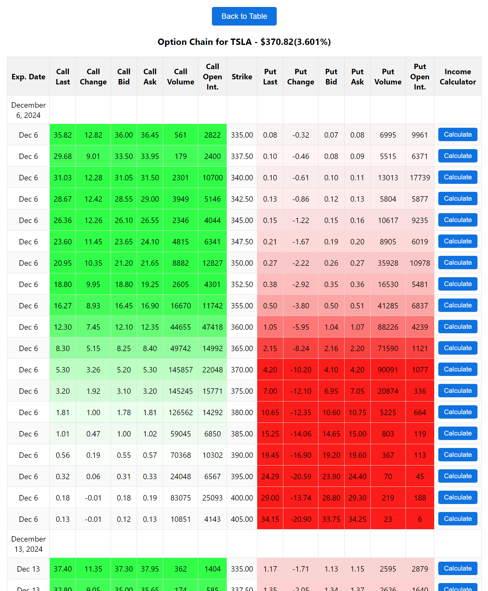
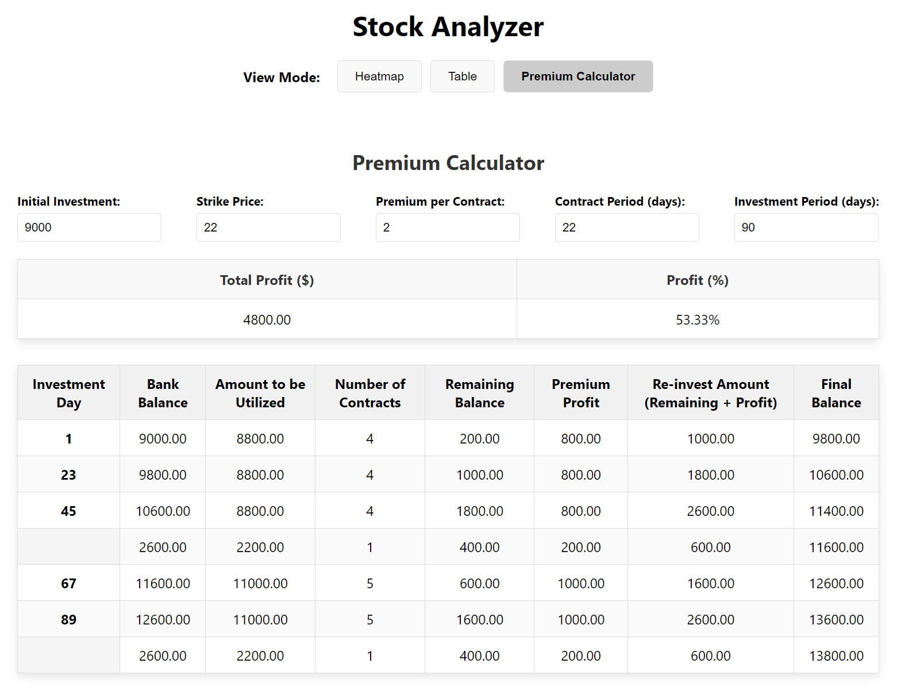

# 📈 STOCK ANALYZER

## 🚀 Summary

**Stock Analyzer** is a comprehensive tool designed to help traders and investors analyze stock market data effectively. Whether you are exploring stock heatmaps, analyzing option chains, or calculating premiums on PUT options, Stock Analyzer has you covered. Built for both novice and experienced market participants, it provides insightful visuals and dynamic tables that simplify complex market data.

---

## ✨ Features

### 1. 📊 Heatmap & Table
- Interactive heatmap visualizing stock performance across different exchanges.
- Table view with sorting options based on:
  - **Symbol**
  - **Last Sale**
  - **% Change**  
  - **Net Change**
  - **Market Cap**

  
*(Heatmap showcasing various stock performances across exchanges)*  

  
*(Table showcasing various stock performances across exchanges)*  

---

### 2. 📈 Side-by-Side Charts
- Compare multiple stocks with side-by-side interactive charts.
- Dynamic time-frame adjustments for in-depth analysis.

  
*(Side-by-side charts displaying stock trends for a specific period)*  

---

### 3. 🧾 Option Chain Analysis
- Detailed option chain with filters for strikes and expiry.
- Integrated analytics for market sentiment.

  
*(Option chain visual with highlighted PUT and CALL options)*  

---

### 4. 🛠️ Premium Calculator
- Calculate premiums for PUT options with real-time data.
- Evaluate risk and potential profit scenarios before trading.

  
*(Premium calculator UI showcasing real-time option pricing)*  

---

## 📂 Installation

### Prerequisites:
- [Node.js](https://nodejs.org/) >= 16.x  
- [Git](https://git-scm.com/)

### Steps:
1. Clone the repository:
   ```bash
   git clone https://github.com/negiadventures/stock_analysis.git
   cd stock_analysis
   ```
2. Install dependencies:
   ```bash
   npm install
   ```
3. Start the development server:
   ```bash
   npm run start
   ```

---

## 📋 Usage

1. Navigate to the homepage. (localhost:3000)
2. Use the heatmap to explore top-performing stocks.
3. Switch to the **Table** tab to view tabular data of stocks based on price.
4. Click on the **Option Chain** button to analyze options data for each stock.
4. Check multiple stocks and click on the **View Chart** button to analyze performance on chart.
5. Switch to the **Premium Calculator** tab for PUT options returns calculator.

---

## 📜 License
This project is licensed under the [MIT License](LICENSE).

---

## 🌟 Contributions
We welcome contributions! Please see our [Contributing Guidelines](CONTRIBUTING.md) for more information.

---
